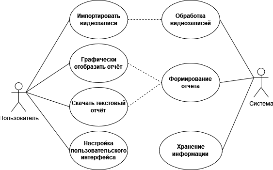
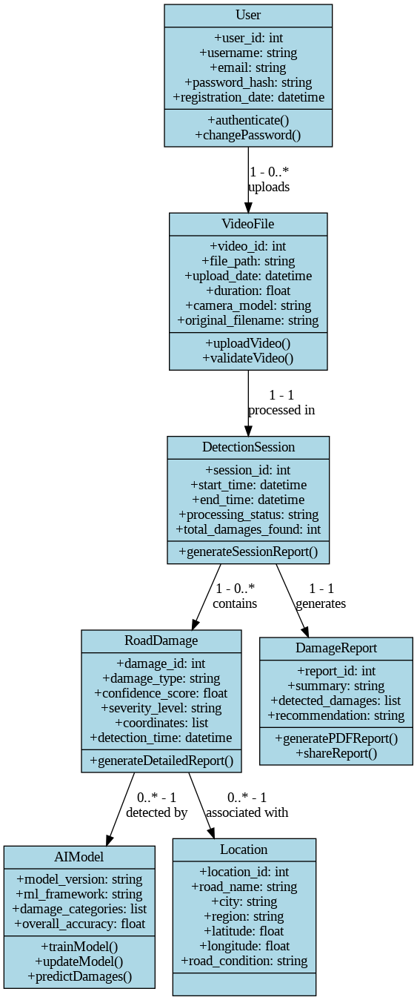

# Практическая работа №0

## Проект: Разработка системы поиска не нормативных дефектов на автомобильных дорогах с твердым покрытием по видеоданным авторегистраторов
- **Определение целей и задач DSS**: Основная цель DSS — автоматизация процесса обнаружения дефектов на дорогах и генерация отчетов.
- **Выбор технологий и инструментов**: Необходимо выбрать подходящие технологии для реализации компьютерного зрения, обработки видео и генерации отчетов.
- **Создание архитектуры системы**: Разработка архитектуры, которая будет поддерживать распределенные вычисления и обработку больших объемов данных.

## Первоначальные требования к DSS
- **Функциональные требования**:
  - Импорт видеофайлов с автомобильных регистраторов.
  - Автоматическое обнаружение дефектов дорожного полотна с использованием компьютерного зрения.
  - Генерация отчетов о найденных дефектах.
  - Экспорт отчетов в различные форматы (PDF, Excel и т.д.).

- **Нефункциональные требования**:
  - Высокая производительность и скорость обработки видео.
  - Масштабируемость системы для обработки больших объемов данных.
  - Удобный и интуитивно понятный интерфейс пользователя.

## Применение Domain-Driven Design к требованиям

- **Определение доменных моделей**:
  - **Видео**: Сущность, представляющая видеофайл, загруженный пользователем.
  - **Дефект**: Сущность, представляющая обнаруженный дефект дорожного полотна.
  - **Отчет**: Сущность, представляющая сгенерированный отчет о дефектах.

- **Разработка доменных сервисов**:
  - **Сервис обработки видео**: Отвечает за обработку видео и обнаружение дефектов.
  - **Сервис генерации отчетов**: Отвечает за создание отчетов на основе обнаруженных дефектов.

- **Создание агрегатов и репозиториев**:
  - **Агрегат видео**: Управляет жизненным циклом видеофайлов.
  - **Агрегат дефектов**: Управляет информацией о дефектах.
  - **Агрегат отчетов**: Управляет созданием и хранением отчетов.

## Модель предметной области DSS

### 1. Сущности

### **Видео (Video)**
- **Атрибуты**:
  - `VideoId` (уникальный идентификатор видео)
  - `FileName` (название файла)
  - `FilePath` (путь к файлу на сервере)
  - `Duration` (длительность видео)
  - `UploadDate` (дата загрузки)
- **Описание**: Представляет видеофайл, загруженный пользователем для анализа.

### **Дефект (Defect)**
- **Атрибуты**:
  - `DefectId` (уникальный идентификатор дефекта)
  - `Type` (тип дефекта, например, трещина, выбоина, яма)
  - `Severity` (степень серьезности дефекта)
  - `Location` (географические координаты дефекта)
  - `Timestamp` (временная метка в видео, где обнаружен дефект)
  - `VideoId` (ссылка на видео, в котором обнаружен дефект)
- **Описание**: Представляет обнаруженный дефект на дорожном полотне.

### **Отчет (Report)**
- **Атрибуты**:
  - `ReportId` (уникальный идентификатор отчета)
  - `CreationDate` (дата создания отчета)
  - `Defects` (список дефектов, включенных в отчет)
  - `Status` (статус отчета, например, "черновик", "готово")
- **Описание**: Представляет отчет, сгенерированный на основе обнаруженных дефектов.

---

## 2. Агрегаты

### **Агрегат видео **
- **Корневая сущность**: `Video`
- **Связанные сущности**: `Defect`
- **Описание**: Управляет жизненным циклом видеофайлов и связанных с ними дефектов.

### **Агрегат дефектов**
- **Корневая сущность**: `Defect`
- **Связанные сущности**: `Video`
- **Описание**: Управляет информацией о дефектах и их связью с видео.

### **Агрегат отчетов**
- **Корневая сущность**: `Report`
- **Связанные сущности**: `Defect`
- **Описание**: Управляет созданием и хранением отчетов на основе дефектов.

---

### 3. Сервисы

### **Сервис обработки видео**
- **Функции**:
  - Загрузка видеофайлов.
  - Обработка видео для обнаружения дефектов.
  - Сохранение результатов анализа.
- **Описание**: Отвечает за обработку видео и обнаружение дефектов.

### **Сервис генерации отчетов**
- **Функции**:
  - Создание отчетов на основе обнаруженных дефектов.
  - Экспорт отчетов в различные форматы (PDF, Excel и т.д.).
- **Описание**: Отвечает за генерацию и экспорт отчетов.

---

## Выбранный инструментарий
- **Язык программирования**: Python.
- **IDE**: PyCharm.
- **Фреймворки и библиотеки**: OpenCV, TensorFlow/PyTorch, YOLO, Flask, Pandas, Numpy, SQLAlchemy.
- **Базы данных**: PostgreSQL (с PostGIS для геоданных).
- **Контейнеризация**: Docker.
- **CI/CD**: GitHub Actions/GitLab CI.
- **Тестирование**: Pytest

## Модель данных для реализации

### На уровне приложения
Объектно-ориентированная модель для инкапсуляции данных и логики.
### На уровне хранения
Реляционная модель (к примеру PostgreSQL, или альтернатива SQLite) для структурированных данных (дороги, дефекты, пользователи и т.д.).
