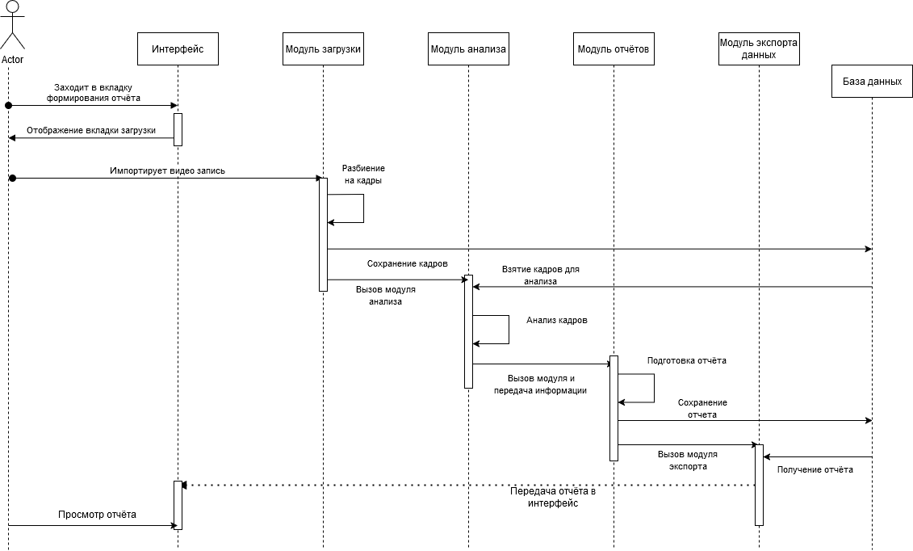

# Практическая работа №1

## Проект: Разработка системы поиска не нормативных дефектов на автомобильных дорогах с твердым покрытием по видеоданным авторегистраторов
По скольку модель всё еще находиться в разработке я реализую для той работы связь пользователя и сервера, асинхронную работу, докеризацию ит.д.
В дальнейшем я интегрирую это в полноценный проект, а пока отрабатываю работу на программе заглушке.

## Задание 1
Подключить async-runtim в auth service используя библиотеку asyncio

## Задание 2
Подключена БД для user_service с использование SQLite

## Задание 3

1. Выбранный фреймворк (API endpoints, Console app, etc.)

Используется Flask для создания REST API.
Основные API endpoints реализованы в виде функций, декорированных @app.route.
Входная точка приложения: if __name__ == '__main__': app.run() запускает сервер.

Пример:

    @app.route('/users', methods=['GET']) — возвращает список пользователей.
    @app.route('/users', methods=['POST']) — создает нового пользователя.

2. Application (принимает и возвращает DTO)

Функции в этом слое принимают DTO (Data Transfer Objects) из API Layer, обрабатывают их и передают в Domain Layer.
Возвращают результаты в виде DTO, которые затем отправляются клиенту.

Пример:

    UserService.create_user(user_data: dict) — принимает данные пользователя, передает их в Domain Layer.
    UserService.get_user(user_id: int) — возвращает данные пользователя.

3. Domain (принимает Command, возвращает Event)

    domain/
    Содержит основные сущности:
        user.py — описание пользователя (id, name, email, age).

4.Infrastructure (реализация Repository)

    repositories/
        user_repository.py — реализация репозитория для работы с базой данных (SQLite).

5. Util (логирование и т.д.)

    utils/
        logger.py — настройка логирования.

## Задание 4

Обновить или написать необходимые тесты.
Задание выполено в файле test и подготовлено для будущего CI-CD

## Задание 5

Сформировать первичные Dockerfile и docker-compose Вашей DSS и её инфраструктуры

Подготовлены 2 Докерфайла для User_service и Auth_service.

Также подготовлен Docker compose для всего контейнера

